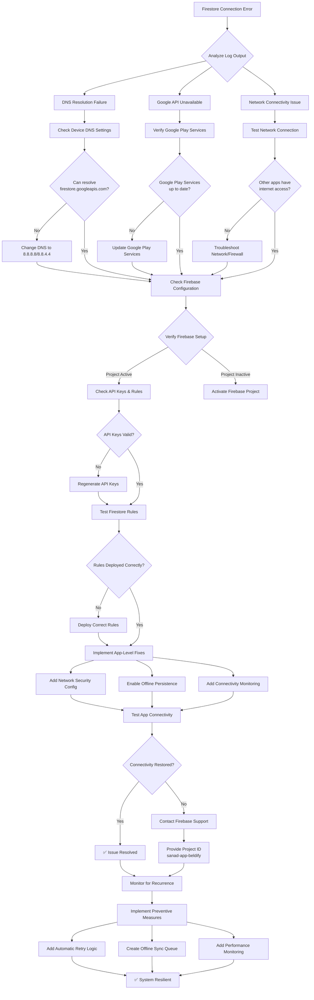

# Firestore Connectivity Troubleshooting Workflow

## Key Decision Points

### 1. **DNS Resolution Check**
- Test: `nslookup firestore.googleapis.com`
- Fix: Change device DNS to Google DNS (8.8.8.8)
- Alternative: Use network security config to allow cleartext traffic

### 2. **Google Play Services Verification**
- Check: Settings → Apps → Google Play Services
- Update: Via Google Play Store
- Alternative: Use Firebase without certain Google APIs

### 3. **Network Connectivity Test**
- Test: Other apps, browser access
- Fix: Network reset, different network
- Diagnostic: `ping 8.8.8.8`

### 4. **Firebase Configuration**
- Verify: Project active in Firebase Console
- Check: API keys not restricted
- Test: Firestore rules with emulator

### 5. **App-Level Implementation**
- Add: Network security configuration
- Enable: Firestore offline persistence
- Implement: Connectivity state monitoring

## Implementation Priority

### High Priority (Immediate)
1. Network security configuration
2. Basic connectivity checks
3. Error logging enhancement

### Medium Priority (Next Release)
1. Offline persistence enablement
2. Automatic retry logic
3. Local cache fallback

### Low Priority (Future)
1. Advanced sync queue
2. Performance monitoring
3. Admin diagnostics dashboard

## Testing Checklist

### Pre-Implementation Tests
- [ ] Device can resolve Firebase domains
- [ ] Google Play Services up to date
- [ ] Firebase project active and accessible
- [ ] API keys not expired or restricted

### Post-Implementation Tests
- [ ] App works in airplane mode
- [ ] Data syncs when connection restored
- [ ] Error messages user-friendly
- [ ] Performance not degraded

### Regression Tests
- [ ] Existing features still work
- [ ] Authentication flows intact
- [ ] Payment processing functional
- [ ] Real-time updates working

## Monitoring Metrics

### Key Performance Indicators
- Firestore connection success rate (>99%)
- Network request latency (<2s)
- Offline operation success rate (>95%)
- User-reported issues (<1% of users)

### Alert Thresholds
- Connection failure rate >5% for 5 minutes
- Average latency >5s for 10 minutes
- Offline queue size >100 operations
- Error rate increase >50% from baseline

## Rollback Plan

If issues occur after implementation:

1. **Immediate Rollback** (Critical issues)
   - Revert network security config changes
   - Disable new connectivity monitoring
   - Roll back to previous app version

2. **Phased Rollback** (Minor issues)
   - Disable specific features causing issues
   - Increase logging for debugging
   - Hotfix with targeted corrections

3. **Progressive Rollout** (Preventive)
   - Release to 10% of users first
   - Monitor metrics for 24 hours
   - Full rollout if metrics stable

## Support Resources

### Internal Documentation
- `docs/FIRESTORE-SETUP.md` - Firestore configuration
- `docs/QUICK-REFERENCE-FIREBASE-PAYMENT.md` - Firebase setup
- `plans/firestore_connectivity_troubleshooting.md` - This plan

### External Resources
- [Firebase Status Dashboard](https://status.firebase.google.com)
- [Google Cloud Status](https://status.cloud.google.com)
- [Firebase Support](https://firebase.google.com/support)

### Contact Information
- Firebase Project ID: `sanad-app-beldify`
- App Package: `com.sanad.sanad_app`
- Support Email: `mbardouni44@gmail.com`

---

**Document Version**: 1.0  
**Last Updated**: December 31, 2025  
**Next Review**: January 7, 2026  
**Status**: Ready for Implementation